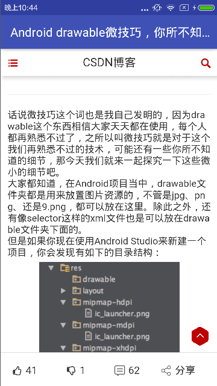

# MaterialDesignStudy
Des：该项目主要用来学习Material Design Support Library和一些android其他技术，目前主要分为俩大部分
- 解析干货集中营的开放API 随时随地掌握技术最新动态
- 有趣的搞笑图片（尝试了MVP设计框架）

其中分别尝试了`不同的实现方式`，解析干货集中营时采用了开源库XRecyclerView提供的刷新，而搞笑图片模块则是使用SwipeRefreshLayout+RecyclerView的刷新方式。本项目主要是用作练习，包含的主要技术点有：
- 抽象和封装
- MaterialDesign控件的使用
- MVP的初步使用
- 封装okhttp解析网络数据
- okhttp配合gson快速解析
- RecyclerView的使用
- 缓存
- 不同的下拉刷新
- fragment实例化的优化
- 一些好用的工具类（AppManager、DoubleClickHelper等）

###效果展示

###使用到的开源库，感谢；感谢使用到图标的其他开源项目和一些精彩代码
- [XRecyclerView](https://github.com/jianghejie/XRecyclerView)
- [okhttp](https://github.com/square/okhttp)
- [gson](https://github.com/google/gson)
- [picasso](https://github.com/square/picasso)
